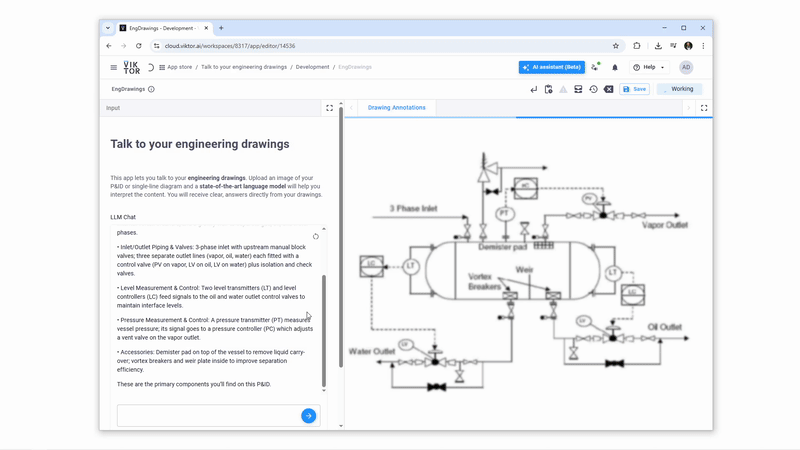
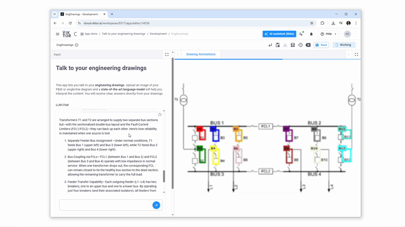

# Talk to Your Engineering Drawings

This app lets you talk to your engineering drawings. Upload an image of your P&ID or single-line diagram and a state-of-the-art language model will help you interpret the content. You will receive clear answers directly from your drawings.

## P&ID 
For P&ID  you can ask multiple question to get a complet undersnting of the process. Here are some examples:

"What is the main purpose of the process shown, and how do the steam lines interact with the vessel to heat the incoming fluid?"
"What are the main components of the P&ID?"
"How does the temperature-control loop (TT 100, TIC 100, TV 100) work together to keep the vessel at the target temperature?"



## Single line diagrams
Similar as the P&ID diagram you can "talk" to your electrical drawings such as single line diagrams. You can ask question like the following:

- "What is the configuration of the substation? Only base your answer on the drawings. If any assumption is made in your answer or if there is uncertainty, state it."
- "How do transformers T1 and T2 support reliability if one source is lost?"



## How Does the App Work?

This application integrates Large Language Models (LLMs) from OpenAI for conversational understanding and Google's Gemini model for visual object detection to provide an interactive experience with your engineering drawings. The [Instructor](https://python.useinstructor.com/) library is utilized to manage structured outputs from both LLMs, ensuring predictable and manageable data formats.

When you upload a drawing and ask a question:
1.  **Conversational AI (OpenAI)**: Your questions are processed by an OpenAI model (e.g., GPT-4o mini). This model understands the context of your drawing and your query, providing textual answers.
2.  **Object Detection (Google Gemini)**: If your query involves identifying or locating components in the drawing, the OpenAI model can trigger an action. This action invokes Google's Gemini model, which specializes in image understanding and object detection, to identify and provide bounding boxes for the requested components.
3.  **Structured Outputs (Instructor)**: Instructor facilitates communication with both OpenAI and Gemini, ensuring that their responses (textual answers or detected object coordinates) are returned in a structured format that the application can easily use.

## Integration between LLM, Object Detection, and VIKTOR Views

The chat and visualization workflow is orchestrated as follows:

1.  **User Interaction**: You interact with the app through [`vkt.Chat`](https://docs.viktor.ai/docs/create-apps/user-input/llm-chat/) and by uploading an image using `vkt.FileField`.
2.  **Controller Logic**: When a message is sent or an image uploaded, the `call_llm` method in the controller is triggered.
3.  **LLM Processing (OpenAI)**: The conversation history and the uploaded image (converted to base64) are sent to the OpenAI model via Instructor. The model is prompted to provide a textual response and, if relevant, an `Action` to detect objects.
4.  **Response Handling**:
    *   **Textual Response**: The textual part of the LLM's response is streamed directly to the chat interface.
    *   **Action for Object Detection**: If the LLM returns an `Action` (e.g., a query like "detect pumps"), this `Action` is serialized to JSON and stored using [`vkt.Storage()`](https://docs.viktor.ai/docs/create-apps/results-and-visualizations/storing-results/):
      ```python
      # In controller.py, call_llm method
      vkt.Storage().set(
          "View", # Key for the stored data
          data=vkt.File.from_data(partial.action.model_dump_json()),
          scope="entity" 
      )
      ```
5.  **Visualization Update**: The `plot_view` method, decorated with [`@vkt.PlotlyView`](https://docs.viktor.ai/docs/create-apps/results-and-visualizations/plots-charts-graphs/), listens for changes in the data stored under the "View" key.
6.  **Object Detection (Gemini)**:
    *   The `plot_view` retrieves the `Action` from `vkt.Storage()`.
    *   It uses the `query` from the `Action` and the uploaded image to call the `detect_objects` function.
    *   `detect_objects` uses the Gemini model (via Instructor) to identify components and return their bounding boxes (`BBoxList`).
7.  **Displaying Annotations**:
    *   The `plot_bounding_boxes_go` function takes the image and the bounding box data to create a Plotly figure with annotations.
    *   This figure is then displayed in the `PlotlyView`.
      ```python
      # In controller.py, plot_view method
      # ... (retrieve action, call detect_objects) ...
      fig = plot_bounding_boxes_go(base64_image_string, bounding_box_data)
      return vkt.PlotlyResult(fig.to_json())
      ```
8.  **Dynamic Updates**: The app manages storage, deleting or updating stored data when inputs change, ensuring the views (chat and annotated drawing) remain current.

## Handling API Keys

To use this application, you need API keys for both OpenAI and Google Gemini.

**Local Development:**
1.  Copy the `.env.example` file to a new file named `.env` in the project's root directory.
2.  Add your API keys to the `.env` file:
    ```
    GEMINI_API_KEY="your-google-gemini-api-key"
    OPENAI_API_KEY="your-openai-api-key"
    ```
    You can obtain a Google API key from [Google AI Studio](https://aistudio.google.com/apikey).
    The `python-dotenv` module loads these keys as environment variables. **Never commit your `.env` file or expose your API keys publicly.**

**Published Apps (VIKTOR Platform):**
For apps deployed on the VIKTOR platform, manage your API keys using VIKTOR’s environment variables. Administrators can set these via the 'Apps' menu in your VIKTOR environment. These variables are encrypted.
For detailed instructions, refer to the [VIKTOR environment variables documentation](https://docs.viktor.ai/docs/create-apps/development-tools-and-tips/environment-variables/).

## Useful Links for You

-   **Instructor Framework**:
    -   [Getting Started](https://python.useinstructor.com/#getting-started)
    -   [Integrations (OpenAI, Gemini, etc.)](https://python.useinstructor.com/integrations/)
-   **OpenAI**:
    -   [API Documentation](https://platform.openai.com/docs)
    -   [OpenAI Cookbook](https://cookbook.openai.com/)
-   **Google Gemini**:
    -   [Gemini API Documentation](https://ai.google.dev/gemini-api/docs)
    -   [Image Understanding with Gemini](https://ai.google.dev/gemini-api/docs/image-understanding)
    -   [Google Gemini Cookbook (Examples)](https://github.com/google-gemini/cookbook)
    -   [Get API Key](https://aistudio.google.com/apikey)
-   **VIKTOR Platform**:
    -   [VIKTOR Chat Component (`vkt.Chat`)](https://docs.viktor.ai/docs/create-apps/user-input/llm-chat/)
    -   [VIKTOR Storage Component (`vkt.Storage`)](https://docs.viktor.ai/docs/create-apps/results-and-visualizations/storing-results/)
    -   [VIKTOR Plotly View Component (`vkt.PlotlyView`)](https://docs.viktor.ai/docs/create-apps/results-and-visualizations/plots-charts-graphs/)
    -   [Environment Variables](https://docs.viktor.ai/docs/create-apps/development-tools-and-tips/environment-variables/)

---
