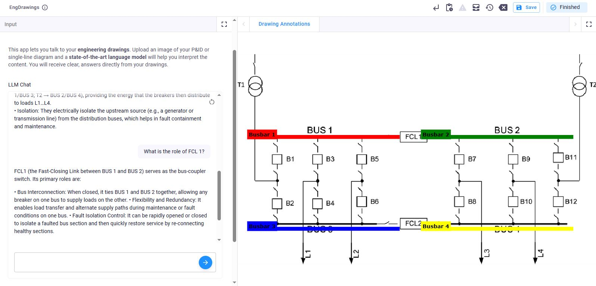

# Talk to Your Engineering Drawings

This app lets you talk to your engineering drawings. Upload an image of your P&ID or single-line diagram and a state-of-the-art language model will help you interpret the content. You will receive clear answers directly from your drawings.



## Features
- **Visual Q&A with OpenAI**: Ask questions about your engineering drawings and get answers using OpenAI's advanced language models.
- **Object Detection with Google Gemini**: Detect and highlight components in your drawings using Google's Gemini model.

## How to Use
1. Upload an image of your engineering drawing (P&ID or single-line diagram).
2. Ask questions or request to detect specific components.
3. The app will respond with clear answers and highlight relevant parts of your drawing.

## API Keys Setup
To use the app, you need API keys for OpenAI and Google Gemini. Copy `.env.example` to `.env` and add your API keys:

```
GEMINI_API_KEY = "your-gemini-api-key"
OPENAI_API_KEY = "your-openai-api-key"
```

## Frameworks and Technologies
- **instructor**: Used to generate structured output responses from the language model.
- **vkt.Storage()**: Used to update and manage the VIKTOR views, allowing dynamic updates based on user interactions and model responses.

---
